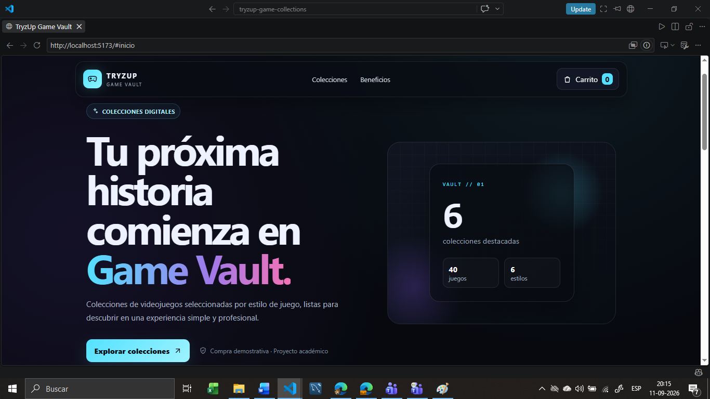
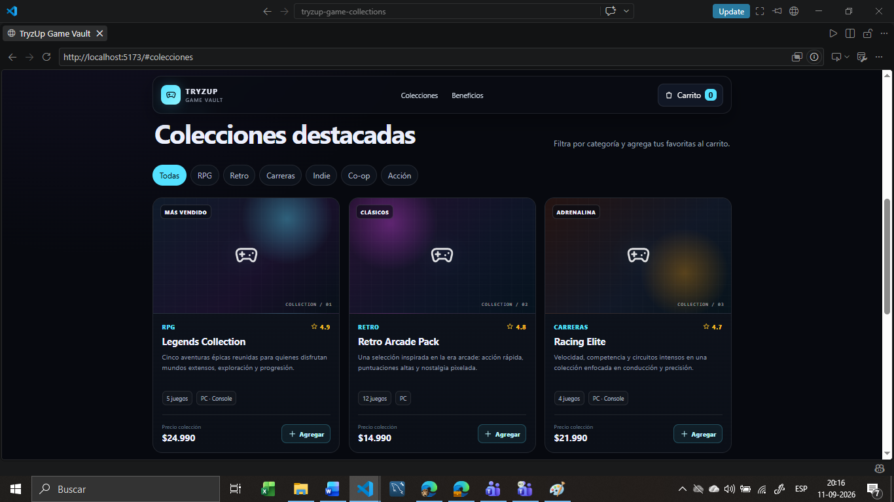

# 🎮 TryzUp Game Vault

E-commerce académico de una sola página desarrollado con **React + Vite**, orientado a la venta de colecciones digitales de videojuegos.

El proyecto fue creado para la evaluación **Componentes Custom para E-commerce en React** del Módulo 2 del Diplomado Full Stack.

## 🎯 Objetivo

Aplicar los principales conceptos revisados en React:

- Componentes reutilizables.
- Uso de props.
- Renderizado de listas con `map()`.
- Uso correcto de `key`.
- Manejo de estado con `useState`.
- Separación de responsabilidades.
- Organización del proyecto por componentes.
- Simulación de datos sin backend.

## 🧩 Componentes creados

El proyecto utiliza componentes funcionales separados dentro de `src/components/`:

- `Header`: muestra la identidad de la tienda y recibe `cartCount` mediante props.
- `Hero`: presentación principal de TryzUp Game Vault.
- `FilterBar`: permite filtrar las colecciones por categoría.
- `ProductGrid`: renderiza el listado de productos utilizando `map()`.
- `ProductCard`: componente reutilizable que recibe los datos de cada colección mediante props.
- `Benefits`: presenta características principales del proyecto.
- `Footer`: muestra la información final del e-commerce.

## 📦 Simulación de datos

Los productos se encuentran en:

```text
src/data/collections.js
```

Cada producto contiene como mínimo los campos solicitados en la evaluación:

```js
{
  id,
  name,
  price,
  category,
  image
}
```

Además, se incorporan datos complementarios como plataforma, cantidad de juegos, valoración, etiqueta y descripción.

## ⚛️ Conceptos React aplicados

- Componentes funcionales.
- Props para comunicación padre → hijo.
- `map()` para renderizar listas.
- `key={collection.id}` como identificador único.
- `useState()` para categoría activa, carrito y notificaciones.
- `useMemo()` para obtener las colecciones visibles según el filtro.
- Actualización funcional de estado:

```js
setCartCount((previousCount) => previousCount + 1)
```

## 🛠️ Tecnologías utilizadas

- React
- JavaScript
- Vite
- HTML5
- CSS3
- Node.js / npm
- Git
- GitHub
- GitHub Actions
- GitHub Pages

## 📁 Estructura principal

```text
tryzup-game-collections/
├── .github/
│   └── workflows/
│       └── deploy.yml
├── docs/
│   └── screenshots/
│       ├── home.png
│       └── catalogo.png
├── src/
│   ├── components/
│   ├── data/
│   │   └── collections.js
│   ├── App.jsx
│   ├── main.jsx
│   └── styles.css
├── .gitignore
├── index.html
├── package.json
├── package-lock.json
├── vite.config.js
└── README.md
```

## ▶️ Ejecutar el proyecto

Clonar el repositorio:

```bash
git clone https://github.com/TryzUp-Nexus/tryzup-game-vault-react.git
```

Ingresar a la carpeta:

```bash
cd tryzup-game-vault-react
```

Instalar dependencias:

```bash
npm install
```

Ejecutar el servidor de desarrollo:

```bash
npm run dev
```

Luego abrir en el navegador la dirección local indicada por Vite.

## 🏗️ Build de producción

```bash
npm run build
```

La versión de producción se genera en la carpeta `dist/`.

## 📸 Capturas de pantalla

### Vista principal del e-commerce



### Catálogo de colecciones



## 🌐 Demo en vivo

El proyecto está desplegado mediante GitHub Actions y GitHub Pages:

https://tryzup-nexus.github.io/tryzup-game-vault-react/

## 📚 Proyecto académico

**Diplomado Full Stack — Módulo 2**  
Proyecto: **TryzUp Game Vault**
