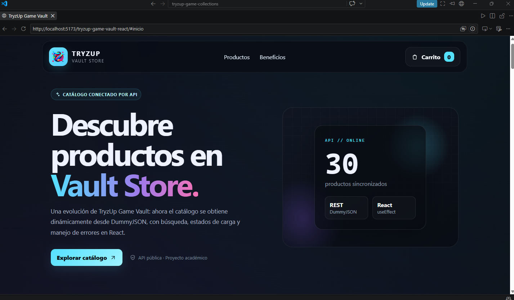
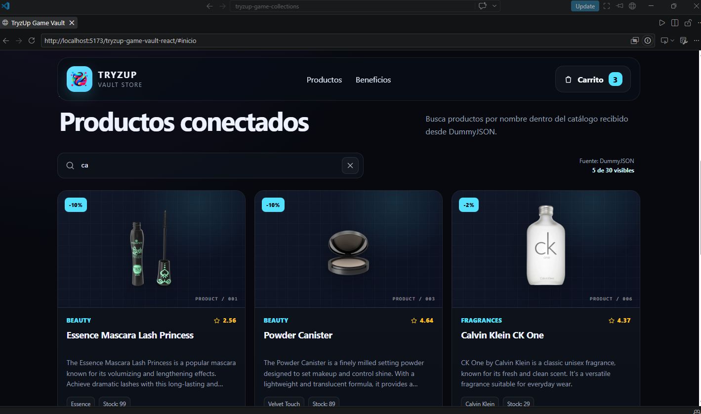
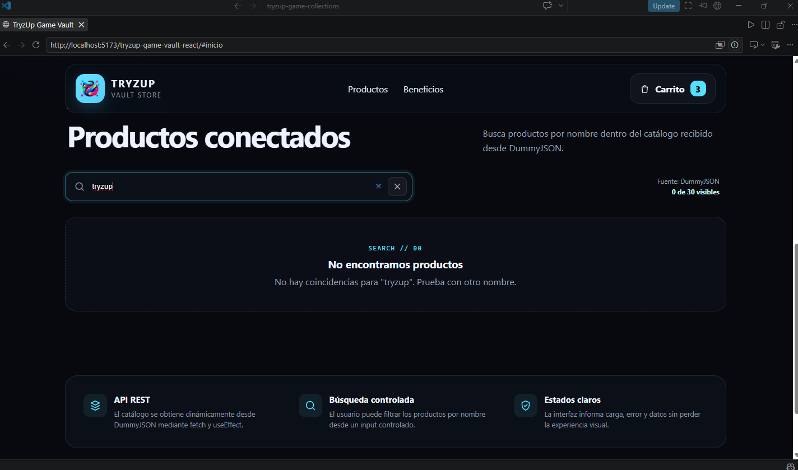
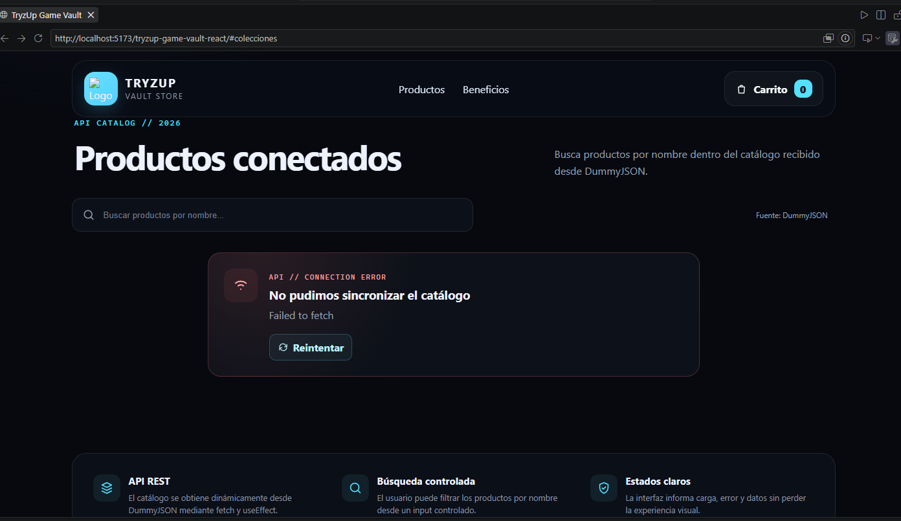

# 🛍️ TryzUp Vault Store

E-commerce académico desarrollado con **React + Vite** que consume una API pública para obtener y renderizar productos dinámicamente.

Este proyecto corresponde a la segunda evolución de **TryzUp Game Vault**, conservando la arquitectura modular de la versión anterior e incorporando consumo de API, búsqueda controlada y estados de carga y error.

## 🌐 Demo en vivo

https://tryzup-nexus.github.io/tryzup-game-vault-react/

## 🧭 Evolución del proyecto

- **v1.0.0 — TryzUp Game Vault:** componentes reutilizables, props, listas, estado y catálogo simulado.
- **v2.0.0 — TryzUp Vault Store:** consumo de productos desde DummyJSON mediante `fetch` + `useEffect`, búsqueda y manejo de estados de interfaz.

Release de la primera entrega:

https://github.com/TryzUp-Nexus/tryzup-game-vault-react/releases/tag/v1.0.0

## 🎯 Objetivo

Construir una aplicación de e-commerce en React capaz de:

- obtener productos desde una API;
- renderizarlos dinámicamente;
- buscar productos por nombre;
- informar el estado de carga;
- mostrar un mensaje ante errores de conexión;
- reutilizar componentes;
- mantener una interfaz clara y responsiva.

## 🔌 API utilizada

```text
https://dummyjson.com/products
```

El acceso a la API se encuentra centralizado en:

```text
src/services/productApi.js
```

El ciclo de carga de datos se maneja mediante:

```text
src/hooks/useProducts.js
```

## ⚛️ Estados principales

`useProducts` administra:

```js
products
loading
error
```

y ejecuta la consulta mediante `fetch` dentro de `useEffect`.

La búsqueda utiliza además un estado controlado:

```js
const [searchTerm, setSearchTerm] = useState("");
```

## 🧩 Componentes

- `Header`: logo, identidad de la tienda y contador del carrito.
- `Hero`: presentación de la evolución v2 y estado del catálogo.
- `SearchBar`: input controlado para buscar productos por nombre.
- `ProductList`: renderiza los productos mediante `map()`.
- `ProductCard`: recibe cada producto mediante props.
- `Loader`: muestra visualmente el estado de carga.
- `ErrorMessage`: informa errores de la API y permite reintentar.
- `Benefits`: resume características técnicas.
- `Footer`: información básica.
- `Icon`: iconografía SVG reutilizable.

## 🗂️ Arquitectura

```text
src/
├── components/
│   ├── Benefits/
│   ├── ErrorMessage/
│   ├── Footer/
│   ├── Header/
│   ├── Hero/
│   ├── Icon/
│   ├── Loader/
│   ├── ProductCard/
│   ├── ProductList/
│   └── SearchBar/
├── hooks/
│   └── useProducts.js
├── services/
│   └── productApi.js
├── utils/
│   └── formatPrice.js
├── App.jsx
├── App.css
├── index.css
└── main.jsx
```

## 🔄 Flujo de datos

```text
DummyJSON
   ↓
productApi.js
   ↓
useProducts.js
   ↓
App.jsx
   ↓
ProductList
   ↓
ProductCard
```

## 🛠️ Tecnologías utilizadas

- React
- JavaScript
- Vite
- HTML5
- CSS3
- Fetch API
- DummyJSON
- Git
- GitHub
- GitHub Actions
- GitHub Pages

## ▶️ Ejecutar

```bash
git clone https://github.com/TryzUp-Nexus/tryzup-game-vault-react.git
cd tryzup-game-vault-react
npm install
npm run dev
```

## 🏗️ Build

```bash
npm run build
```

## 🔎 Búsqueda

`SearchBar` es un input controlado. El valor se almacena en `searchTerm` y el listado se filtra por `product.title`.

## ⏳ Loading

Mientras:

```js
loading === true
```

se muestra el componente `Loader`.

## 🚨 Error

Si la consulta falla, se muestra `ErrorMessage` y el usuario puede reintentar la solicitud.

## 📸 Capturas de funcionamiento

### Vista general

La aplicación obtiene el catálogo desde DummyJSON y muestra la cantidad de productos sincronizados.



### Búsqueda de productos

El componente `SearchBar` utiliza un input controlado y filtra dinámicamente los productos por nombre.



### Estado sin resultados

Cuando no existen coincidencias, la aplicación muestra un estado vacío sin alterar los datos originales ni romper la interfaz.



### Manejo de errores

Si la API no responde, la aplicación informa el problema y permite volver a intentar la solicitud.


## 📚 Proyecto académico

**Diplomado Full Stack — Módulo 2**  
**Entrega:** E-commerce en React con consumo de API
