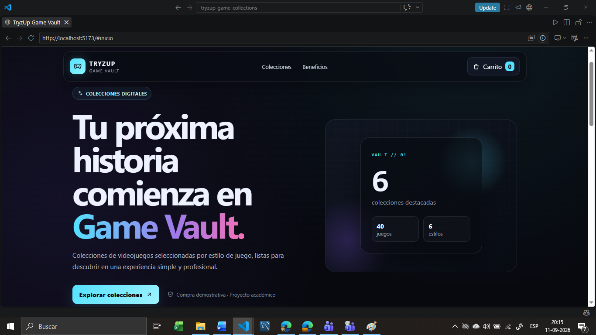
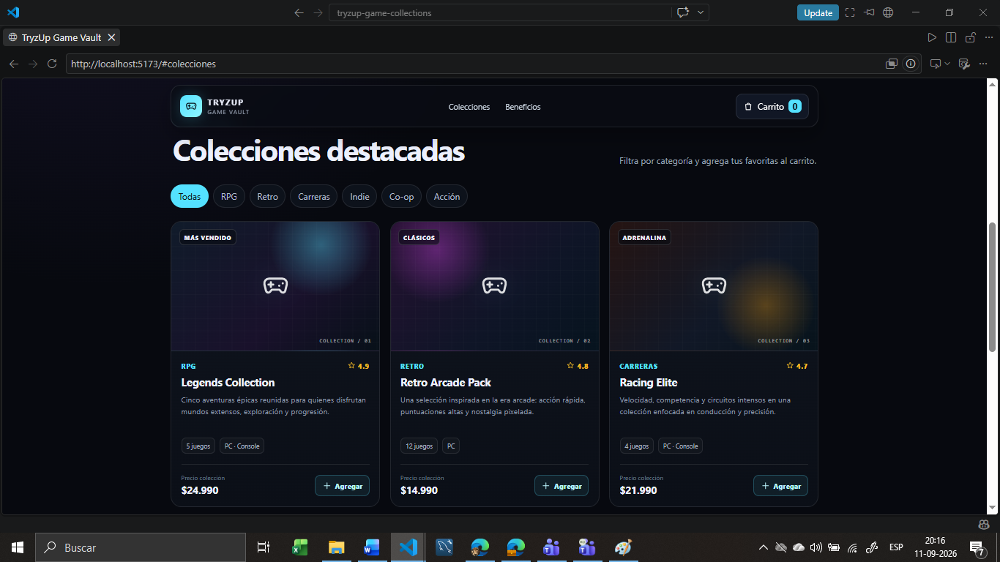

# 🎮 TryzUp Game Vault

E-commerce académico de una sola página desarrollado con **React + Vite**, orientado a la venta de colecciones digitales de videojuegos.

## 🎯 Objetivo

Aplicar componentes reutilizables, props, renderizado con `map()`, `key`, manejo de estado con `useState`, separación de responsabilidades y organización modular.

## ♻️ Refactorización de arquitectura

Después de la revisión académica, el proyecto fue refactorizado para mejorar mantenibilidad y trabajo colaborativo.

- Cada componente vive en su propia carpeta.
- Cada componente visual mantiene su propio archivo CSS.
- Los estilos globales quedaron en `index.css`.
- Los estilos propios de la aplicación quedaron en `App.css`.
- `formatPrice` fue extraída a `src/utils/formatPrice.js`.
- Se mantuvo la misma interfaz y comportamiento funcional.

Detalle del cambio: `docs/architecture-refactor.md`.

## 🧩 Componentes

- `Header`: identidad, navegación y contador del carrito.
- `Hero`: presentación principal.
- `FilterBar`: filtros de categorías.
- `ProductGrid`: renderizado mediante `map()`.
- `ProductCard`: tarjeta reutilizable con props.
- `Benefits`: características principales.
- `Footer`: información final.
- `Icon`: iconografía SVG reutilizable.

## 📦 Datos

Los productos se encuentran en `src/data/collections.js` y contienen `id`, `name`, `price`, `category` e `image`, además de datos complementarios.

## 🧰 Utilidades

`src/utils/formatPrice.js` centraliza el formato de precios CLP y permite reutilizar la función en futuras vistas.

## 🛠️ Tecnologías

React, JavaScript, Vite, HTML5, CSS3, Node.js/npm, Git, GitHub, GitHub Actions y GitHub Pages.

## 📁 Estructura

```text
src/
├── components/
│   ├── Benefits/
│   │   ├── Benefits.jsx
│   │   └── Benefits.css
│   ├── FilterBar/
│   │   ├── FilterBar.jsx
│   │   └── FilterBar.css
│   ├── Footer/
│   │   ├── Footer.jsx
│   │   └── Footer.css
│   ├── Header/
│   │   ├── Header.jsx
│   │   └── Header.css
│   ├── Hero/
│   │   ├── Hero.jsx
│   │   └── Hero.css
│   ├── Icon/
│   │   └── Icon.jsx
│   ├── ProductCard/
│   │   ├── ProductCard.jsx
│   │   └── ProductCard.css
│   └── ProductGrid/
│       ├── ProductGrid.jsx
│       └── ProductGrid.css
├── data/
│   └── collections.js
├── utils/
│   └── formatPrice.js
├── App.jsx
├── App.css
├── main.jsx
└── index.css
```

## ▶️ Ejecutar

```bash
git clone https://github.com/TryzUp-Nexus/tryzup-game-vault-react.git
cd tryzup-game-vault-react
npm install
npm run dev
```

## 🏗️ Build

```bash
npm run build
```

## 📸 Capturas





## 🌐 Demo

https://tryzup-nexus.github.io/tryzup-game-vault-react/

## 📚 Proyecto académico

**Diplomado Full Stack — Módulo 2**  
Proyecto: **TryzUp Game Vault**
